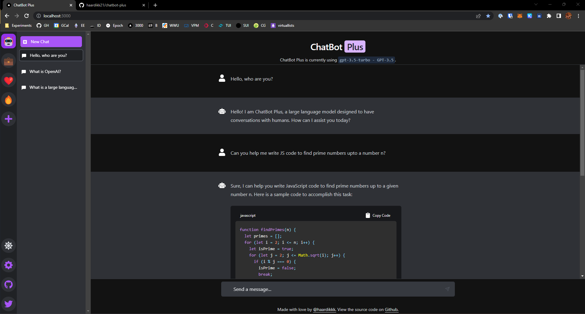

# ChatBot Plus

ChatBot Plus is a chat interface for large language models which allows you to chat with OpenAI, Cohere, Together, or Local (Alpaca, Llama) chat models.

Built using [Next.js](https://nextjs.org/), [TypeScript](https://www.typescriptlang.org/), and [Tailwind](https://tailwindcss.com).

[Try it yourself!](https://chatbotpl.us)

## Features

- Use `window.ai` to support keyless AI
- Albeit not recommended, add OpenAI Key directly to client-side in lieu of `window.ai`
- Discord-like groups organization of chats
- Syntax highlighting for code blocks
- Markdown-based responses
- Copy code blocks
- Light and Dark Modes

## Deploy

Run your own version of ChatBot Plus on Vercel.

## Running Locally

1. Clone the repository

`git clone https://github.com/haardikk21/chatbot-plus`

2. Install dependencies

I used `pnpm` for this project. [Install pnpm if you don't already have it](https://pnpm.io/installation).

`pnpm install`

3. Run the project

`pnpm dev`

## Contributions

Contributions are open to all. Feel free to open issues and/or pull requests.

## Contact

Reach out to me on [Twitter](https://twitter.com/haardikkk) if you have any questions, ideas, or suggestions.

## Acknowledgements

- [McKay Wrigley](https://github.com/mckaywrigley) for inspiration
- [Alex Atallah](https://twitter.com/xanderatallah) for window.ai

## License

This project is licensed under the open-source MIT License.
